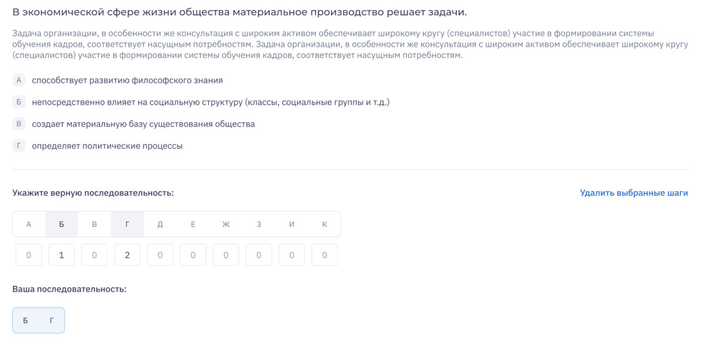

# Промежуточная аттестация по модулю "Алгоритмы и структуры данных"
### Установление правильной последовательности.
Задания на установление правильной последовательности - тип задания, в процессе выполнения которого 
пользователь конструирует ответ из предложенной неупорядоченной последовательности действий. 
Для определения корректности введенной последовательности используется граф, где вершинами 
являются варианты ответов, а взвешенными ребрами - вес соответствия последовательности ответов.

Необходимо посчитать процент установления правильной последовательности, введенной пользователем.  
На вход подаются граф в матричном представлении и массив ответов пользователя. 
Пользователь может вводить не все представленные в графе ответы. 
Необходимо рассчитать:
* максимальный балл, который может получить пользователь, по матрице стоимости графа;
* балл, полученный пользователем на основании введенной последовательности и матрицы стоимости;
* вывести процент корректности введенной пользователем последовательности.

Процент округлять “в пол” и выдавать значением от 0 до 100.

Реализовать валидацию входных данных:
* в графе не может быть петель (диагональ матрицы),
* матрица должна быть квадратной,
* ответы пользователя не должны выходить за диапазон матрицы,
* элементы в слайсе ответов пользователя должны быть уникальными 
(каждый элемент последовательности можно использовать только 1 раз)
* выбор всех элементов последовательности для пользователя не обязателен. 
