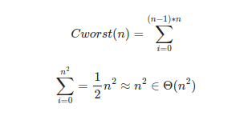

1. Представлен алгоритм для определения “зеркальности” матрицы размером n на n.
Вычислите его сложность, используя изученные формулы, в качестве размера входных данных примите n.
```go
func IsReflectMatrix(a [][]int) bool {
	n := len(a)
	if n == 0 {
		return true
	}

	for i := 0; i < n-1; i++ {
		if len(a[i]) != n {
			return false
		}
		for j := 0; j < n; j++ {
			if a[i][j] != a[j][i] {
				return false
			}
		}
	}
	return true
}
```
Размер входных данных **n**\
Основная операция **сравнение**\
Количество операций будет зависеть не только от ширины n матрицы, но и от того зеркальная ли матрица (зеркальная матрица == худший случай) \
Внешний и внутренний цикл выполняются n-1 и n раз соответсвенно\
\
Сложность ***O(n^2)***

2. Представлен рекурсивный алгоритм для поиска наименьшего элемента слайса.
   Вычислите его сложность, используя изученные формулы.

```go
func MinEl(a []int) int {
	// только для первичной проверки
	if len(a) == 0 {
		return 0
	}
	if len(a) == 1 {
		return a[0]
	}
	t := MinEl(a[:len(a)-1])
	if t <= a[len(a)-1] {
		return t
	}
	return a[len(a)-1]
}
```
Размер входных данных **n**\
Основная операция **сравнение**\
Количество операций зависит только от размера слайса. ***M(n)*** - кол-во операций\
***M(n)=M(n−1)+1***, а когда слайс пустой никаких операций не требуется ***M(0)=0***\
***M(n)=M(n-1)+1=[M(n-2)+1]+1=...=M(n-i)+i=M(n-n)+n=n***\
Сложность ***O(n)***

3. Представлен другой рекурсивный алгоритм для поиска наименьшего элемента слайса.
   Вычислите его сложность, используя изученные формулы.
   Сравните эффективность алгоритма с предыдущим вариантом.
   Попробуйте увеличить скорость выполнения функции, используя инструменты Го.
   Как изменится сложность алгоритма при увеличении скорости?
```go
func MinEl2(a []int) int {
	// только для первичной проверки
	if len(a) == 0 {
		return 0
	}
	if len(a) == 1 {
		return a[0]
	}
	t1 := MinEl2(a[:len(a)/2])
	t2 := MinEl2(a[len(a)/2:])
	if t1 <= t2 {
		return t1
	}
	return t2
}
```
Размер входных данных **n**\
Основная операция **сравнение**\
Количество операций зависит только от размера слайса. ***A(n)*** - кол-во операций\
***A(n)=2A(n/2)+1***, а когда слайс пустой никаких операций не требуется ***A(0)=0***\
***A(n)=2^k\*A(n/2^k)+2^k-1***\
***k=log2n и n/2^k=1***\
***A(n)=n\*A(1)+n-1***\
***A(n)=2n-1=n***\
Сложность ***O(n)***\
Для ускорения попробовал засунуть вычисления каждой половины массива в свою горутину, но чисто теоретически это никак не влияет на сложность алгоритма, т.к. ему все так же нужно обработать каждый элементы а сложность алгоритма у нас по прежнему O(n)